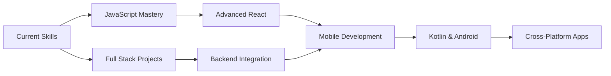

# 👋 Hello, I'm Mirko Joel Ruhl

<div align="center">
  <a href="https://git.io/typing-svg">
    
  </a>
  
  <br><br>
  
  [](https://developer.mozilla.org/en-US/docs/Web/JavaScript)
  [](https://www.python.org/)
  [](https://developer.android.com/)    
    
  
  [](https://github.com/RuhlMirko)
</div>

---

## 📖 Table of Contents

- [About Me](#-about-me)
- [Tech Stack](#-tech-stack)
- [GitHub Statistics](#-github-statistics)
- [Featured Projects](#-featured-projects-2024)
- [Goals for 2025](#-goals-for-2025)
- [Connect with Me](#-connect-with-me)

---

## 🚀 About Me

I'm a **Full Stack Web Developer** with a passion for creating beautiful, functional applications that merge modern design principles with cutting-edge technology. My journey in development spans across web and desktop applications, with a growing interest in mobile development.

```javascript
const mirko = {
  code: ["JavaScript", "Python", "HTML", "CSS", "Kotlin"],
  askMeAbout: ["web dev", "UI/UX design", "graphic design", "app development"],
  technologies: {
    frontEnd: ["React", "Bootstrap 5", "Tailwind CSS", "HTML5", "CSS3"],
    backEnd: ["Python", "Streamlit"],
    mobile: ["Android Studio", "Kotlin"],
    desktop: ["Tkinter", "PySimpleGUI", "ttkbootstrap"],
    tools: ["Git", "VS Code", "Figma"],
  },
  currentFocus:
    "Building interactive web applications and learning mobile development",
  funFact: "I love combining technical skills with creative design thinking!",
};
```

### 🎯 What I Do

- 🌐 **Web Development**: Creating responsive, user-friendly websites and web applications
- 🎨 **UI/UX Design**: Designing intuitive interfaces with modern design principles
- 📱 **Mobile Development**: Learning Android development with Kotlin
- 💻 **Desktop Applications**: Building cross-platform desktop apps with Python

---

## 🛠 Tech Stack

<div align="center">

### 🌐 Frontend Development

<p>
  
  
  
  
  
  
</p>

### 🔧 Backend & Tools

<p>
  
  
  
  
</p>

### 📱 Mobile Development

<p>
  
  
</p>

</div>

---

## 📊 GitHub Statistics

<div style='display:flex;flex-direction:column;align-items:center;gap:5px;'>
  
  
    
    
  
  
  **📈 Don't forget to explore my GitHub repositories below!**
  
</div>

---

## 🌟 Featured Projects (2024)

<div align="center">

| Project                                                                    | Description                                             | Tech Stack            |
| -------------------------------------------------------------------------- | ------------------------------------------------------- | --------------------- |
| 🎲 [**Liar's Dice**](https://github.com/RuhlMirko/js-lying-dice)           | Interactive dice game with strategic gameplay mechanics | JavaScript, HTML, CSS |
| 🃏 [**Blackjack Game**](https://github.com/RuhlMirko/javascript-blackjack) | Classic card game with smooth animations and game logic | JavaScript, CSS, HTML |
| ⏰ [**Pomodoro Timer**](https://github.com/RuhlMirko/pomodoro-timer)       | Productivity app with customizable work/break intervals | JavaScript, CSS, HTML |
| 🖼️ [**Web Wallpapers**](https://github.com/RuhlMirko/wallpaper-engine)     | Dynamic wallpaper collection with interactive elements  | HTML, CSS, JavaScript |

</div>

---

## 🎯 Goals for 2025

<div align="center">



</div>

### 🚀 Key Objectives

- **📚 JavaScript Mastery**: Deepen my JavaScript knowledge and build more complex applications
- **🔧 Full Stack Development**: Integrate frontend skills with robust backend solutions
- **📱 Mobile Development**: Master Android development with Kotlin and Android Studio
- **🌐 Portfolio Expansion**: Create 10+ new projects showcasing diverse skills
- **🤝 Open Source**: Contribute to open-source projects and collaborate with the community

---

## 📫 Connect with Me

<div align="center">
  
  [](https://www.linkedin.com/in/mirko-ruhl-730581200/)
  [](https://github.com/RuhlMirko)
  [](#)
  
  <br><br>
  
  **💼 Looking for web development services?** Feel free to reach out!
  
  **🤝 Open to collaborating** on interesting projects and learning opportunities
  
</div>

---

<div align="center">
  
  ### 💫 "Code is like humor. When you have to explain it, it's bad." - Cory House
  
  
  
</div>
